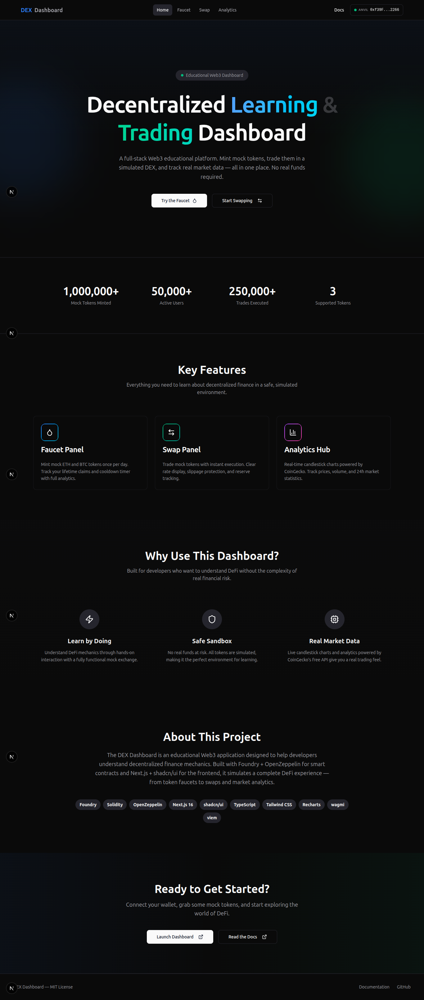
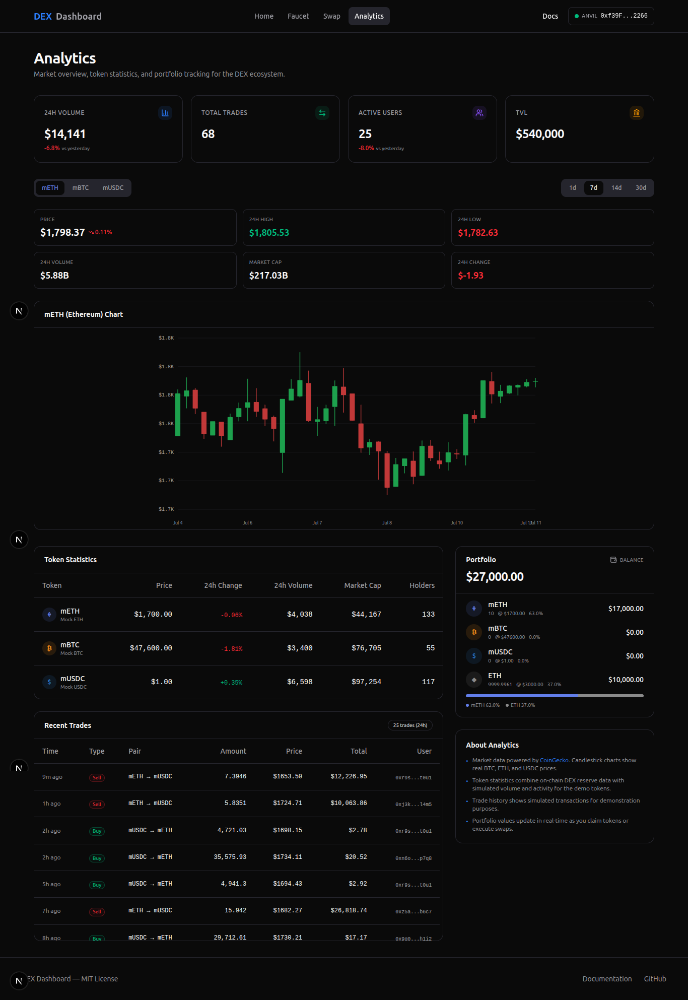
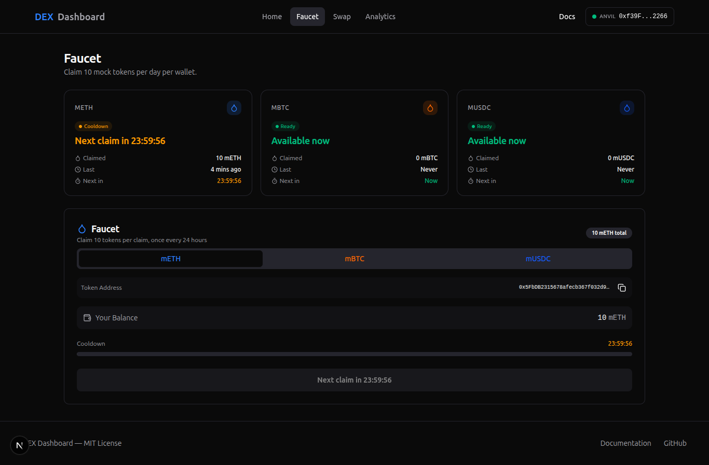
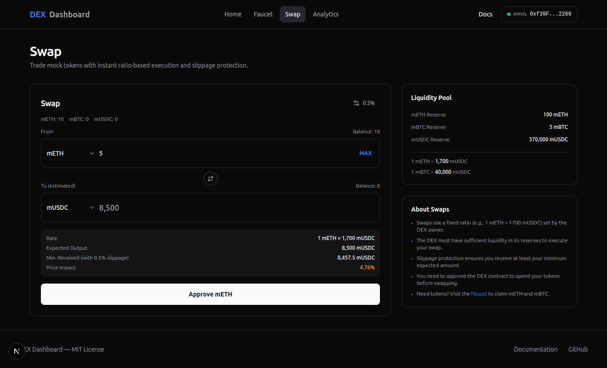

# 🚀 DEX Dashboard

<div align="center">

**A full-stack educational Web3 platform — mint mock tokens, swap them on a simulated DEX, and track live market analytics.**

[](https://soliditylang.org/)
[](https://nextjs.org/)
[](https://book.getfoundry.sh/)
[](https://www.typescriptlang.org/)
[](LICENSE)

<a href="#-screenshots">📸 Screenshots</a> •
<a href="#-features">✨ Features</a> •
<a href="#%EF%B8%8F-tech-stack">🛠️ Tech Stack</a> •
<a href="#-quick-start">🚀 Quick Start</a> •
<a href="#-project-structure">🏛️ Structure</a> •
<a href="#-testing">🧪 Testing</a>

</div>

---

## 📸 Screenshots

<table>
  <tr>
    <td width="50%"></td>
    <td width="50%"></td>
  </tr>
  <tr>
    <td align="center"><strong>🏠 Home Dashboard</strong></td>
    <td align="center"><strong>📊 Analytics & Charts</strong></td>
  </tr>
  <tr>
    <td width="50%"></td>
    <td width="50%"></td>
  </tr>
  <tr>
    <td align="center"><strong>💰 Token Faucet</strong></td>
    <td align="center"><strong>🔄 Swap Interface</strong></td>
  </tr>
</table>

---

## ✨ Features

### 💰 Faucet
Mint **mETH**, **mBTC**, and **mUSDC** mock tokens with a 24-hour cooldown per token per wallet. Track your lifetime claims, remaining cooldown timers, and token statistics — all on-chain.

### 🔄 Swap
Trade mock tokens with **6 swap paths** powered by a fixed-ratio pricing engine:
| Pair | Direction |
|---|---|
| mETH ↔ mUSDC | Direct swap via ratio |
| mBTC ↔ mUSDC | Direct swap via ratio |
| mETH ↔ mBTC | Cross-rate derivation through mUSDC |

Includes **slippage protection** (set your minimum output), **reserve tracking**, and **approval management**.

### 📊 Analytics
- **Market Stats** — 24h volume, total trades, active users, TVL (powered by CoinGecko API)
- **Candlestick Charts** — Real-time price action for ETH, BTC, and combined overview
- **Token Statistics** — Price, 24h change, market cap, and volume per token
- **Trade History** — Recent swaps with timestamps, amounts, and participants
- **Portfolio Overview** — Token balances, USD values, allocation breakdown

### 🔌 Wallet Integration
Connect any wallet via **wagmi** + **viem**. View your address, connected status, and token balances across pages.

### 🏠 Landing Page
Animated hero section with CTA buttons, live stats counters (total mints, swaps, users, TVL), feature cards with gradient icons, and tech stack badges.

---

## 🛠️ Tech Stack

| Layer | Technology |
|---|---|
| **Smart Contracts** | [Foundry](https://book.getfoundry.sh/) + [OpenZeppelin](https://www.openzeppelin.com/contracts) |
| **Language (Contracts)** | Solidity ^0.8.27 |
| **Frontend** | [Next.js 16](https://nextjs.org/) (App Router, static generation) |
| **Language (Frontend)** | TypeScript (strict mode) |
| **UI Library** | [shadcn/ui](https://ui.shadcn.com/) + [Tailwind CSS v4](https://tailwindcss.com/) |
| **Charts** | [Recharts](https://recharts.org/) |
| **Wallet** | [wagmi](https://wagmi.sh/) + [viem](https://viem.sh/) |
| **Icons** | [Lucide](https://lucide.dev/) |
| **Market Data** | [CoinGecko API](https://www.coingecko.com/en/api) (Free Tier) |
| **Testing** | Foundry (forged), Vitest, Testing Library |
| **Automation** | Makefile |

### Smart Contracts

| Contract | Description |
|---|---|
| [`MockERC20`](contracts/src/MockERC20.sol) | ERC20 token with faucet-restricted minting. Deployed as **mETH**, **mBTC**, **mUSDC**. |
| [`Faucet`](contracts/src/Faucet.sol) | Time-locked faucet — claim 10 tokens per 24 hours per token. |
| [`MockDEX`](contracts/src/MockDEX.sol) | Fixed-ratio DEX with 6 swap paths, slippage protection, and reserve tracking. |

All contracts inherit from **OpenZeppelin** (Ownable, ERC20, SafeERC20) for battle-tested security.

---

## 🚀 Quick Start

### Prerequisites
- [Node.js](https://nodejs.org/) >= 18.0.0
- [Foundry](https://book.getfoundry.sh/) (forge, cast, anvil)
- Git

### 1. Clone & Install

```bash
git clone https://github.com/Men6d656e/DEX.git
cd DEX
make install
```

### 2. Build Contracts

```bash
make build-contracts
```

### 3. Run Contract Tests

```bash
make test-contracts
```

### 4. Start Local Node & Deploy

```bash
# Terminal 1: Start Anvil
make anvil

# Terminal 2: Deploy contracts
make deploy-anvil
```

### 5. Configure Environment (Optional)

For live CoinGecko market data, create `frontend/.env.local`:

```bash
NEXT_PUBLIC_COINGECKO_API_KEY=your_api_key_here
```

[Get a free API key](https://www.coingecko.com/en/api)

### 6. Start Frontend

```bash
make dev
# Or step by step: make install-frontend && make dev-frontend
```

Open [http://localhost:3000](http://localhost:3000) in your browser.

### 7. Deploy & Auto-Update Addresses

```bash
make deploy-update
# Deploys to Anvil and auto-captures contract addresses into the frontend config
```

### 8. Production Build

```bash
make prod
```

---

## 🏛️ Project Structure

```
DEX/
├── contracts/                    # Foundry smart contracts
│   ├── src/
│   │   ├── MockERC20.sol         # Mock tokens (mETH, mBTC, mUSDC)
│   │   ├── Faucet.sol            # Time-locked token faucet
│   │   └── MockDEX.sol           # Fixed-ratio DEX with 6 swap paths
│   ├── test/                     # Solidity tests (182+ tests)
│   ├── script/
│   │   └── Deploy.s.sol          # Deployment script
│   └── foundry.toml              # Foundry configuration
├── frontend/                     # Next.js 16 application
│   ├── src/
│   │   ├── app/
│   │   │   ├── page.tsx          # Home / Landing page
│   │   │   ├── faucet/           # Token faucet page
│   │   │   ├── swap/             # Token swap page
│   │   │   └── analytics/        # Market analytics page
│   │   ├── components/
│   │   │   ├── ui/               # shadcn/ui primitives (13 components)
│   │   │   ├── home/             # Landing page components
│   │   │   ├── swap/             # Swap panel components
│   │   │   ├── faucet/           # Faucet claim & analytics
│   │   │   ├── analytics/        # Charts, stats, portfolio
│   │   │   └── layout/           # Header, navigation
│   │   ├── hooks/                # Custom React hooks
│   │   ├── lib/                  # Utilities, constants, ABI types
│   │   └── providers.tsx         # Web3 provider setup
│   └── package.json
├── images/                       # Screenshots for README
├── docs/                         # GitHub Pages documentation
├── scripts/                      # Utility scripts
│   └── update-addresses.sh       # Auto-capture deployed contract addresses
├── Makefile                      # Automation (install, build, test, deploy)
└── README.md                     # This file
```

---

## 🧪 Testing

```bash
make test              # Run all tests (contracts + frontend)
make test-contracts    # Run only Foundry tests (182+ tests)
make test-frontend     # Run only frontend tests
make coverage          # Generate Foundry coverage report
```

The Solidity test suite includes:
- **35 tests** for MockERC20 (minting, faucet, ownership, ERC20 standards)
- **51 tests** for Faucet (claims, cooldowns, edge cases, ownership)
- **96 tests** for MockDEX (swaps, liquidity, cross-rate ETH↔BTC, fuzz tests, invariant tests)

**16 fuzz functions** × 256 runs each + **4 invariant tests** × 256 runs × 15 depth.

---

## 🔧 Makefile Commands

| Command | Description |
|---|---|
| `make install` | Install all dependencies (forge + npm) |
| `make build` | Build contracts + frontend |
| `make test` | Run all tests |
| `make anvil` | Start local Anvil node (port 8545) |
| `make deploy-anvil` | Deploy to Anvil |
| `make deploy-sepolia` | Deploy to Sepolia testnet |
| `make deploy-update` | Deploy to Anvil + auto-update frontend addresses |
| `make dev` | Install frontend deps + start dev server |
| `make dev-frontend` | Start frontend dev server (localhost:3000) |
| `make prod` | Build + serve production |
| `make prod-frontend` | Serve production build |
| `make generate-abi` | Generate type-safe wagmi hooks from ABIs |
| `make coverage` | Generate coverage report |
| `make clean` | Clean all artifacts |
| `make fmt` | Format Solidity + TypeScript |
| `make docs` | Serve docs locally (port 3001) |

---

## 📄 License

MIT — see [LICENSE](LICENSE) for details.

---

## 🤝 Contributing

1. Fork the repository
2. Create a feature branch (`git checkout -b feature/amazing-feature`)
3. Commit your changes (`git commit -m 'Add amazing feature'`)
4. Push to the branch (`git push origin feature/amazing-feature`)
5. Open a Pull Request

---

<div align="center">
  <sub>Built with ❤️ for learning decentralized finance.</sub>
</div>
